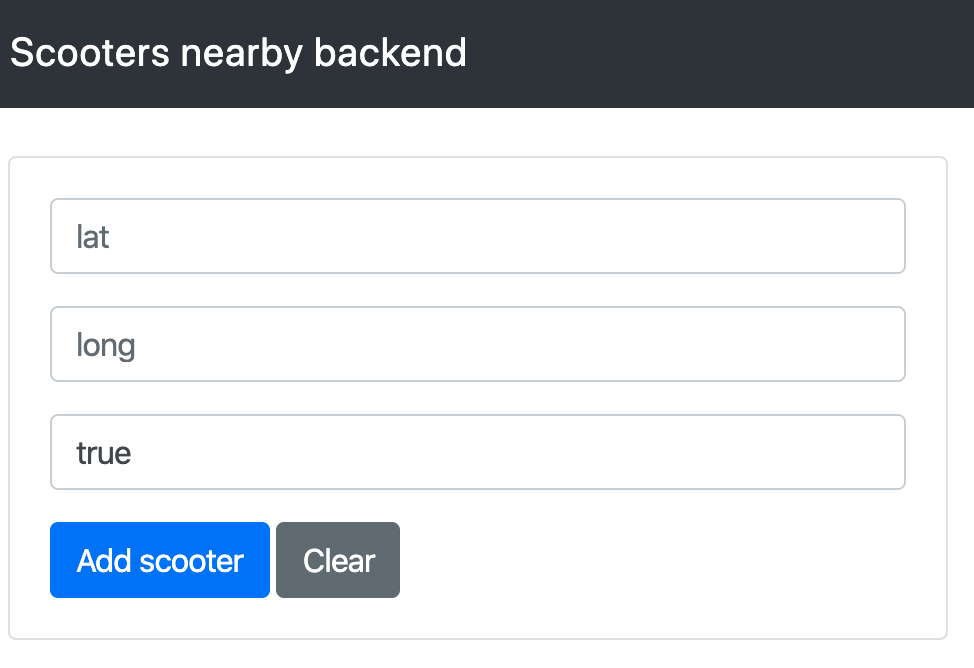

# Rest api for fetching nearby scooters using Node, ExpressJs and MongoDB:

## Prerequisite
Mongodb setup is required to run this app:

[MongoDB for windows](https://docs.mongodb.com/manual/tutorial/install-mongodb-on-windows)

[MongoDB for Mac](https://docs.mongodb.com/manual/tutorial/install-mongodb-on-os-x/)

[MongoDB for Linux](https://docs.mongodb.com/manual/administration/install-on-linux/)

## Steps to run applications:rocket:

1.  Start mongodb service (refer above links)

2.  Start node application and create web server at `localhost:3000`

    > npm start

3.  To insert sample locations points of scooters
    call api:

    > `http://localhost:3000/api/create-test-locations`

4.  UI interface to create more locations based on your preference:

    > `http://localhost:3000`
    > 

5.  API to get nearby-scooters:

    > `http://localhost:3000/api/get-nearby-scooters/:noOfScooters/:latitude/:longitude/:radiusMeters`

         Example: http://localhost:3000/api/get-nearby-scooters/6/1.2765707/103.845848/6000
         
         Response format:
         {
               "type":"ScooterCollection",
               "features":[
                  {
                     "type":"Scooter",
                     "geometry":{
                        "type":"Point",
                        "coordinates":[
                           103.845848,
                           1.2765707
                        ]
                     }
                  }
                  ...
               ]
            }

## Any problems, suggestions?
    > vipul.zambare1993@gmail.com
